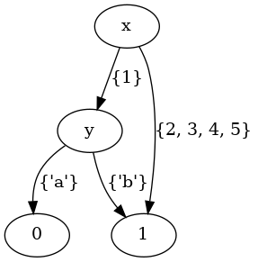

# Py-MDD

Python abstraction around Binary Decision Diagrams to implement
Multi-valued Decision Diagrams.

[](https://cloud.drone.io/mvcisback/py-mdd)
[](https://mjvc.me/py-mdd)
[](https://codecov.io/gh/mvcisback/py-mdd)
[](https://badge.fury.io/py/mdd)
[](https://opensource.org/licenses/MIT)

## About

Multi-valued Decision Diagrams (MDD)  are a way to represent discrete function: 

    f : A₁ × A₂ × … × Aₙ → B.

Conceptually, a MDD for `f` can be thought of as a compressed decision tree (in the form of a directed acyclc graph).

For example, if we have a function over two variables,

    x ∈ {1,2,3,4,5}, y ∈ {'a','b'}

with possible outputs `f(x, y) ∈ {-1, 0, 1}`, then the following diagram represents the function:

    f(x, y) = 1 if (x ≡ 1 and y ≡ 'a') else 0

<figure style="display: flex; justify-content: center; flex-direction: row">

    
This library provides abstractions to easily create and manipulate MDDs.

# Installation

If you just need to use `py-mdd`, you can just run:

`$ pip install mdd`

For developers, note that this project uses the
[poetry](https://poetry.eustace.io/) python package/dependency
management tool. Please familarize yourself with it and then
run:

`$ poetry install`


# Usage

For the impatient, here is a basic usage example:

```python
import mdd

interface = mdd.Interface(
    inputs={
        "x": [1, 2, 3],
        "y": [6, 'w'], 
        "z": [7, True, 8],
    }, 
    output=[-1, 0, 1],
)
func = interface.constantly(-1)
assert func({'x': 1, 'y': 'w', 'z': 8}) == -1

# Can access underlying BDD from `dd` library.
# Note: This BDD encodes both the function's output
#       *and* domain (valid inputs).
assert func.bdd.dag_size == 33
```

If 33 seems very large to you, this is just a constant function after
all, note that as the following sections illustrate, its easy to
implement alternative encodings which can be much more compact. <a href="#note2">[0]</a>

## Variables, Interfaces, and Encodings

The `mdd` api centers around three objects:

1. [`Variable`](https://mjvc.me/py-mdd/mdd.html#mdd.mdd.Variable): Representation of a named variable taking on values in
   from a finite set described by an aiger circuit.
1. [`Interface`](https://mjvc.me/py-mdd/mdd.html#mdd.mdd.Interface): Description of inputs and outputs of a Multi-valued Decision Diagram.
1. [`DecisionDiagram`](https://mjvc.me/py-mdd/mdd.html#mdd.mdd.DecisionDiagram): Representation of a Multi-valued Decision Diagram that conforms
   to an interface. This object is a wrapper around a Binary Decision Diagram object (from
[dd](https://github.com/tulip-control/dd)).

By default, variables use one-hot encoding, but all **input**
variables can use arbitrary encodings by defining a bit-vector
expression describing **valid** inputs and a encode/decoder pair from
`int`s to the variable's domain.


```python
# One hot encoded by default.
var1 = mdd.to_var(domain=["x", "y", "z"], name="myvar1")

# Hand crafted encoding using `py-aiger`.

import aiger_bv

# Named 2-length bitvector circuit.
bvexpr = aiger_bv.uatom(2, 'myvar3')

domain = ('a', 'b', 'c')
var2 = mdd.Variable(
     encode=domain.index,        # Any -> int
     decode=domain.__getitem__,  # int -> Any
     valid=bvexpr < 4,           # 0b11 is invalid!
)

# Can create new variable using same encoding, but different name.
var3 = var2.with_name("myvar3")

var4 = mdd.to_var(domain=[-1, 0, 1], name='output')
```

A useful feature of variables is that they can generate an `aiger_bv`
BitVector object to describe circuits in terms of a variable.

```python
a_int = var2.encode('a')
y_int = var1.encode('y')

# BitVector Expression testing if var2 is 'a' and var1 is 'y'.
expr = (var2.expr() == a_int) & (var1.expr() == y_int)
```

Given these variables, we can define an input/output interface.

```python
# All variables must have distinct names.
interface = mdd.Interface(inputs=[var1, var2, var3], output=var4)
```

Further, as the first example showed, if the default encoding is fine,
then we can simply pass a dictionary inplace of inputs and/or a
iterable in place of the output. In this case, a 1-hot encoding will
be created using the order of the variables.

```python
interface = mdd.Interface(
    inputs={
        "x": [1, 2, 3],      # These are
        "y": [6, 'w'],       # 1-hot
        "z": [7, True, 8],   # Encoded.
    }, 
    output=[-1, 0, 1],       # uuid based output name.
)
```

Finally, given an interface we can create a Multi-valued Decision
Diagram. There are five main ways to create a `DecisionDiagram`:

1. Given an interface, create a constant function:
   ```python
   func = interface.constantly(1)
   ```

2. Wrap an `py-aiger` compatible object:
   ```python
   import aiger_bv as BV
    
   x = interface.var('x')  # Access 'x' variable.
   out = interface.output  # Access output variable.

   expr = BV.ite(
       x.expr() == x.encode(2),       # Test.
       out.expr() == out.encode(0),   # True branch.
       out.expr() == out.encode(-1),  # False branch.
   )
   func = interface.lift(expr)
   assert func({'x': 2, 'y': 6, 'z': True}) == 0
   assert func({'x': 1, 'y': 6, 'z': True}) == -1
   ```

3. Wrap an existing Binary Decision Diagram:
   ```python
   bdd = mdd.to_bdd(expr)      # Convert `aiger` expression to bdd.
   func = interface.lift(bdd)  # bdd type comes from `dd` library.
   assert func({'x': 2, 'y': 6, 'z': True}) == 0
   assert func({'x': 1, 'y': 6, 'z': True}) == -1
   ```

4. Partially Evaluate an existing `DecisionDiagram`:
   ```python
   constantly_0 = func.let({'x': 2})
   assert func({'y': 6, 'z': True}) == 0
   ```

5. Override an existing `DecisionDiagram` given a predicate:
   ```python
   # Can be a BDD or and py-aiger compatible object.
   test = x.expr() == x.encode(1)
   # If x = 1, then return 1, otherwise return using func.
   func2 = func.override(test=test, value=1)
   assert func2({'x': 1, 'y': 6, 'z': True}) == 1
   ```

## BDD Encoding Details

The `py-mdd` library uses a Binary Decision Diagram to represent a
multi-valued function. The encoding slighly differs from the standard
reduction <a href="#note1">[1]</a> from mdds to bdds by assuming the following:

1. If a variable encoding is invalid, then the bdd maps it to `0`.
1. The output is 1-hot encoded, i.e., there is a variable for each
   outcome.
1. If a `bdd` has all input variables fixed to a valid assignment, the
   resulting `bdd` depends on exactly one output varible, which then
   determines the output.

Any bdd that conforms to this encoding can be wrapped up by an
approriate `Interface`.

## Ordering `DecisionDiagram`s

The underlying BDD can be reordered to respect variable ordering by
providing a complete list of variable names to the `order` method.

```python
func.order(['x', 'y', 'z', func.output.name])
```

## Converting to Directed Graph (networkx)

If the `networkx` python package is installed:

`$ pip install networkx`

or the `nx` option is added when installing `py-mdd`:

`$ pip install mdd[nx]`

then one can export a `DecisionDiagram` as a directed graph:

```python
from mdd.nx import to_nx

graph = to_nx(func)  # Has BitVector expressions on edges to represent guards.

graph2 = to_nx(func, symbolic_edges=False)  # Has explicit sets of values on edges to represent guards.
```


<strong id="note2">[0]:</strong> To get a sense for how much overhead is introduced, consider the corresponding Zero Suppressed Decision Diagram (ZDD) of a 1-hot encoding. A classic result (see Art of Computer Programming vol 4a) is the ZDD size bounds the BDD size via O(#variables*|size of ZDD|).

<strong id="note1">[1]:</strong> Srinivasan, Arvind, et al. "Algorithms for discrete function manipulation." 1990 IEEE international conference on computer-aided design. IEEE Computer Society, 1990.

